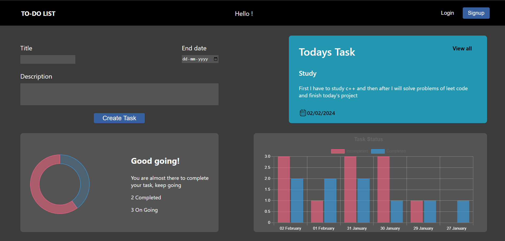

# Todo Task Manager
Todo Task Manager is a simple task management application that allows users to create, update, and delete tasks. It's built with a React 

and typscript as front-end and an Express and nodejs back-end, with MongoDB as the database.

## Features

User Authentication: Users can sign up and log in to manage their tasks securely.     ---- Under construction

CRUD Operations: Users can create, read, update, and delete tasks.

Responsive Design: The application is responsive and works well on desktop and mobile devices.

Chart: Implemented Chart for the user to handling a large number of tasks efficiently.

## Technologies Used

### Front-end:

- React
- React Router
- Axios
- CSS
- Chart.js
- react-router-dom
- react-scripts
- TypeScript

### Back-end:

- Express.js
- MongoDB
- Mongoose
- TypeScript
- bcrypt
- JSON Web Tokens (JWT) for authentication
- Pino

## Installation

Clone the repository:

bash

Copy code

git clone https://github.com/harshKumar029/PriorityPulse_taskmanager_MERN.git

Navigate to the project directory:

bash

Copy code

cd todo-task-manager

Install dependencies:

Start the server

backend : npm run start

frontend: npm start

Open your browser and visit http://localhost:3000 to use the application.

Usage

Sign up for a new account or log in with an existing one.

you can add new tasks, update existing tasks, and delete tasks as needed.

## Contributing

Contributions are welcome! If you find any bugs or have suggestions for improvement, please create an issue or submit a pull request.
